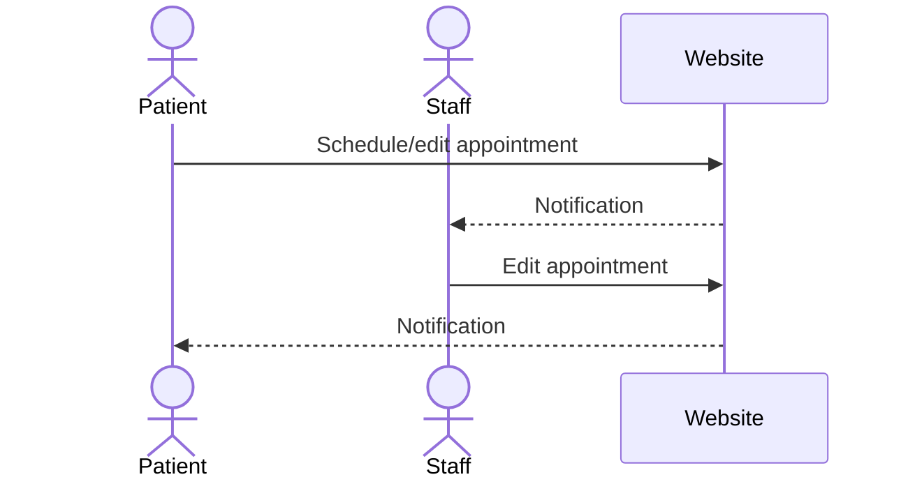

# Rappt

[My Notes](notes.md)

A website to help medical professionals schedule appointments more intelligently, allowing emergency appointments to be accommodated by giving consideration to symptoms and urgency when scheduling appointments, instead of simply using a first-come-first-serve scheduling system and cancellation list.

## 🚀 Specification Deliverable

For this deliverable I did the following. I checked the box `[x]` and added a description for things I completed.

- [x] Proper use of Markdown
- [x] A concise and compelling elevator pitch
- [x] Description of key features
- [x] Description of how you will use each technology
- [x] One or more rough sketches of your application. Images must be embedded in this file using Markdown image references.

### Elevator pitch

Have you ever tried to schedule an urgent doctor's appointment, only to be met with a months long wait because nothing was available sooner? Are you a medical professional looking for a better way to triage patients before they come to the office? Rappt is the tool for you! With Rappt, patients can easily schedule appointments from the web, and our systems will use a custom algorithm to give them a scheduling window that is consistent with the urgency of their symptoms. Medical staff can see the schedule update in real time and make adjustments if necessary.

### Design

This sequence diagram shows sample interactions between patients, staff, and the website, and the associated WebSocket service providing notifications.

### Key features

- Single, secure HTTPS login for patients and healthcare workers.
- Ability for patients and healthcare workers to view relevant appointments and form information.
- Appointment scheduling based on weighted factors, giving users an appropriate window for appointments.
- Suggested diagnosis from public API (PubMedGPT) based on provided symptoms.
- Notifications for patients and healthcare professionals when appointment changes are made.

### Technologies

I am going to use the required technologies in the following ways.

- **HTML** - Webpages for login, submitting information (patients), scheduling an appointment (patients), and viewing/editing the schedule (patients and healthcare workers).
- **CSS** - Create a good looking website with modern design, animations, and responsive design that doesn't look as dreary as most medical websites.
- **React** - Login and form submission for appointments. Calculating severity based on weighted factors/information.
- **Service** - Save and fetch available appointments from database. Query PudMedGPT for severity analysis and possible diagnosis.
- **DB/Login** - Store and create entries for appointments and login information. Store sensetive medical information securely and authenticate to limit content access.
- **WebSocket** - Realtime notifications for changes in appointments from the patient or healthcare professional.

## 🚀 AWS deliverable

For this deliverable I did the following. I checked the box `[x]` and added a description for things I completed.

- [x] **Server deployed and accessible with custom domain name** - [My server link](https://rappt.click).

## 🚀 HTML deliverable

For this deliverable I did the following. I checked the box `[x]` and added a description for things I completed.

- [x] **HTML pages** - 4 pages: login (index), appointments view, appointment creation, and scheduling pages.
- [x] **Proper HTML element usage** - I used header, footer, and main tags appropriately inside the body element. I chose not to use a `<nav>` element since links between pages were not grouped together.
- [x] **Links** - The login page contains links to the appointments page, which links to the appointment creation and scheduling pages. All pages have links to login/logout.
- [x] **Text** - Text is included throughout every page to create a more user-friendly experience. Examples imclude a friendly welcome and an explanation of the website on the homepage, human-readable notifications, and natural language questions on the appointment creation and scheduling pages.
- [x] **3rd party API placeholder** - I added 'inferred diagnosis' and 'severity' to the appointments, which will come from a call to PubMedGPT.
- [X] **Images** - Used logo image in header and favicon, added placeholder for background image, as well as FontAwesome icons for buttons. Those don't show up well yet because of a lack of CSS. 
- [x] **Login placeholder** - The index.html is the login page, and users cannot access their data without logging in. Their name is displayed on the header of the appointments page.
- [x] **DB data placeholder** - The tables on the appointment page and scheduler page represent data pulled from the databse.
- [x] **WebSocket placeholder** - The notification icon in the header and notifications table are a placeholder for WebSocket notifications.

## 🚀 CSS deliverable

For this deliverable I did the following. I checked the box `[x]` and added a description for things I completed.

***IF IT FLICKERS IN AND OUT, IT'S A DEVTOOLS GLITCH. Prof. Jensen looked at it and he was puzzled too, but I think it's working now.***

- [x] **Header, footer, and main content body** - All styled appropriately and consistent for each page.
- [x] **Navigation elements** - I used nav elements styled with flexbox to organize and evenly space the buttons to navigate around the page.
- [x] **Responsive to window resizing** - I used media queries to resize and reorganize the website to look good on all sample devices in the DevTools.
- [x] **Application elements** - I used a consistent window-on-background design and a consistent color palette across the main application elements.
- [x] **Application text content** - I used consistent styling and fonts across h# and p elements, and made sure to the best of my ability that no text is cut off.
- [X] **Application images** - I used and resized background images, design elements, and the logo image to improve the look of my page.

## 🚀 React part 1: Routing deliverable

For this deliverable I did the following. I checked the box `[x]` and added a description for things I completed.

- [x] **Bundled using Vite** - Bundled and deployed!
- [x] **Components** - From what I can see, it looks and functions exactly the same as the HTML version.
- [x] **Router** - Routing between all components, including nested routing for changing header.

## 🚀 React part 2: Reactivity

For this deliverable I did the following. I checked the box `[x]` and added a description for things I completed.

- [x] **All functionality implemented or mocked out** - I added all functionality necessary in the base app, including appointment creation and saving, scheduling based on urgency, login/logout, doctor/patient separation and authentication, showing more info/deleting appointments locally, exporting appointments,, saving/processing forms, and appointment creation syncing between doctors and patients. Some features, such as the full export to iCal, more detailed notifications, ChatGPT integration, and live deletion syncing require a backend/service to do properly, so those functionalities may be mocked out or take time to update.
- [x] **Hooks** - I used useState hooks extensively, especially in the forms. I used useEffect to refresh things that might change, like the notifications and appointment display elements. I used useRef to keep a generator consistent throughout re-renders.

## 🚀 Service deliverable

For this deliverable I did the following. I checked the box `[x]` and added a description for things I completed.

- [ ] **Node.js/Express HTTP service** - I did not complete this part of the deliverable.
- [ ] **Static middleware for frontend** - I did not complete this part of the deliverable.
- [ ] **Calls to third party endpoints** - I did not complete this part of the deliverable.
- [ ] **Backend service endpoints** - I did not complete this part of the deliverable.
- [ ] **Frontend calls service endpoints** - I did not complete this part of the deliverable.

## 🚀 DB/Login deliverable

For this deliverable I did the following. I checked the box `[x]` and added a description for things I completed.

- [ ] **User registration** - I did not complete this part of the deliverable.
- [ ] **User login and logout** - I did not complete this part of the deliverable.
- [ ] **Stores data in MongoDB** - I did not complete this part of the deliverable.
- [ ] **Stores credentials in MongoDB** - I did not complete this part of the deliverable.
- [ ] **Restricts functionality based on authentication** - I did not complete this part of the deliverable.

## 🚀 WebSocket deliverable

For this deliverable I did the following. I checked the box `[x]` and added a description for things I completed.

- [ ] **Backend listens for WebSocket connection** - I did not complete this part of the deliverable.
- [ ] **Frontend makes WebSocket connection** - I did not complete this part of the deliverable.
- [ ] **Data sent over WebSocket connection** - I did not complete this part of the deliverable.
- [ ] **WebSocket data displayed** - I did not complete this part of the deliverable.
- [ ] **Application is fully functional** - I did not complete this part of the deliverable.
